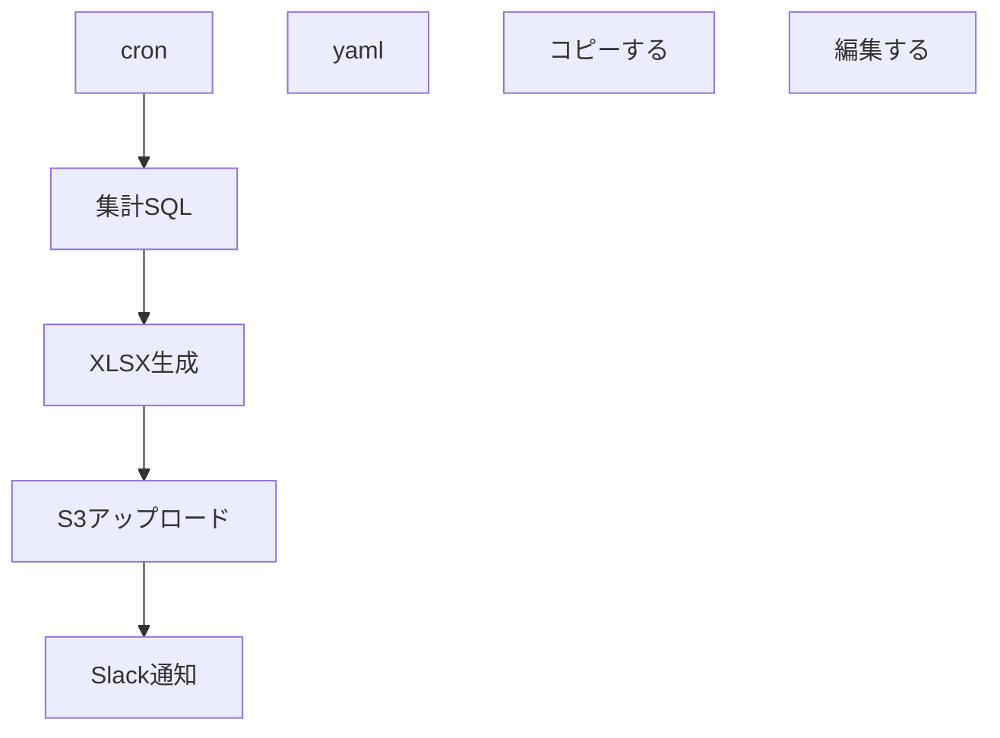

| 項目 | 内容 |
|------|------|
| **実行スケジュール** | 0 3 1 * *（毎月1日03:00） |
| **入力** | attendances |
| **処理概要** | 前月分の勤怠を集計し XLSX 作成 |
| **出力** | /exports/attendance_YYYYMM.xlsx |
| **エラー時対応** | 1 回リトライ後に Slack #alert へ通知 |

## フロー図

