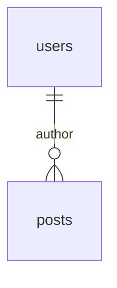
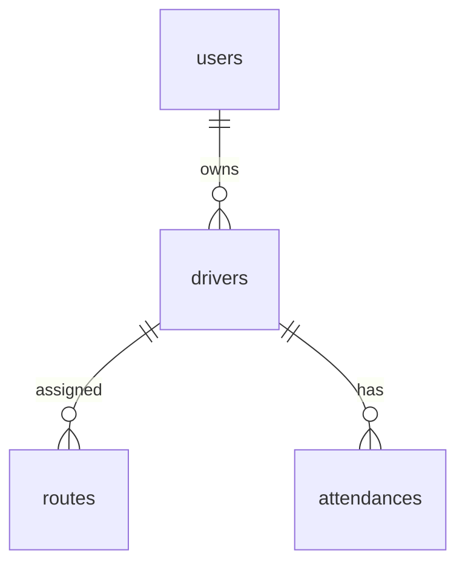

## エンティティ一覧
| テーブル | 目的 | 備考 |
|----------|------|------|
| users | エンドユーザー管理 | PK: id |
| posts | ブログ記事 | FK: author_id → users.id |

## リレーションシップ

# サンプル

## エンティティ一覧
| テーブル | 目的 | 備考 |
|----------|------|------|
| users | アプリ利用者 | PK: id |
| drivers | ドライバー情報 | FK: user_id |
| routes | 配送ルート | FK: driver_id |
| attendances | 勤怠打刻 | FK: driver_id |

## リレーションシップ

