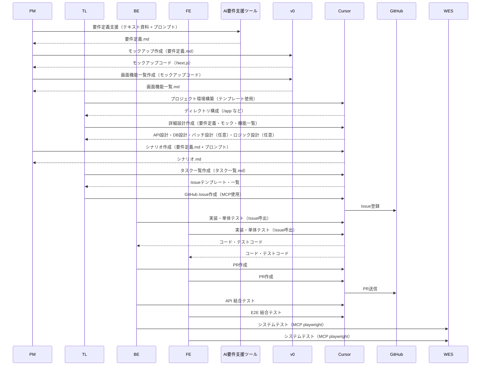

# AI駆動開発フロー（時系列順）

このプロセスは、企画・設計から始まり、開発、テスト、そしてリリースまでを順番に進めていきます。

---

### フェーズ1: 基本設計（PM）

#### 1.要件定義

- **担当:** PM  
- **内容:** `仕様書`を基に、ビジネス要件・機能要件を記載した `要件定義.md` を作成  
- **ツール:** `ChatGPT-o3` / `Gemini` / `Kiro`  
- **インプット:** `要件定義内容をまとめたテキスト資料`  
- **プロンプトテンプレート:** `XXXXXX`  
- **成果物:** `要件定義.md`

#### 2. モックアップ作成

- **担当:** PM  
- **内容:** AIツールを使って `モックアップ` を作成  
- **ツール:** `v0`  
- **インプット:** `要件定義.md`  
- **プロンプトテンプレート:** `XXXXXX`  
- **成果物:** `モックアップコード（Next.js）`

#### 3. 画面機能一覧作成

- **担当:** PM  
- **内容:** モックアップコードから `画面機能一覧.md` を生成  
- **ツール:** `v0`  
- **インプット:** `モックアップコード`  
- **プロンプトテンプレート:** `XXXXXX`  
- **成果物:** `画面機能一覧.md`

---

### フェーズ2: 実装準備（BE / FE）

#### 4. プロジェクト環境構築

- **担当:** BE（TL）  
- **内容:** `Cursor`を用いてディレクトリテンプレートに沿った環境を構築  
- **成果物例:**

/app
/components
/pages
/api
/tests
README.md

#### 5. 詳細設計作成

- **担当:** TL  
- **内容:** モックアップを基に `詳細設計` を生成  
- **ツール:** `Cursor`  
- **インプット:** `要件定義.md` `フロントエンドコード` `画面機能一覧.md`
- **プロンプトテンプレート:** `XXXXXX`  
- **成果物:** `Swagger(API)設計``データベース(スキーマ)設計`'バッチ設計(optional)''詳細ロジックAPI設計(optional)'

#### 6.シナリオ作成

- **担当:** PM
- **内容:** 開発と並行して、テスト用の `シナリオ.md` を作成
- **ツール:** `Cursor`  
- **インプット:** `要件定義.md` 
- **プロンプトテンプレート:** `XXXXXX`  
- **成果物:** `シナリオ.md'

#### 7. 実装タスク一覧作成
- **担当:** TL
- **内容:** これまで作成した成果物からタスク一覧を作成する。
- **ツール:** `Cursor`  
- **参照:** `タスク一覧.md` `Issueテンプレート.md`
- **プロンプトテンプレート:** `XXXXXX`
- **成果物:** `シナリオ.md'

#### 8. Github_Issue作成
- **担当:** TL 
- **内容:** Github MCPを使って、タスク一覧からGithub Issue作成する。
- **ツール:** `Cursor(Github MCP)`  

---

### フェーズ3: 開発・単体テスト（BE & FE）

#### 9. 実装と単体テスト

- **担当:** BE / FE  
- **内容:** Github MCPを使って、担当のIssueを呼び出し、開発・単体テストを実装する。
- **ツール:** `Cursor(Github MCP)`  
- **成果物:** コード、テストコード

#### 10. PR作成

- **担当:** BE / FE  
- **内容:** 実装後に Github MCPを使って`PR（プルリクエスト）` を作成する。
- **ツール:** `Cursor(Github MCP)`  
- **成果物:** PR（プルリクエスト）

---

### フェーズ4: 結合・システムテスト

#### 11. 結合テスト（Integration Test）

- **担当:** BE / FE  
- **内容:** 担当範囲に応じて以下を並行実施：
- **ツール:** `Cursor`

BE: APIテスト（Cursor）
FE: E2Eテスト（Cursor）

#### システムテスト（System Test）

- **担当:** BE / FE  
- **内容:** 全体を通した最終確認  
- **ツール:** `Cursor(MCP playwright)`
- **インプット:** `シナリオ.md'
- **プロンプトテンプレート:** `XXXXXX`  
- **成果物:** `シナリオテストコード'

---

