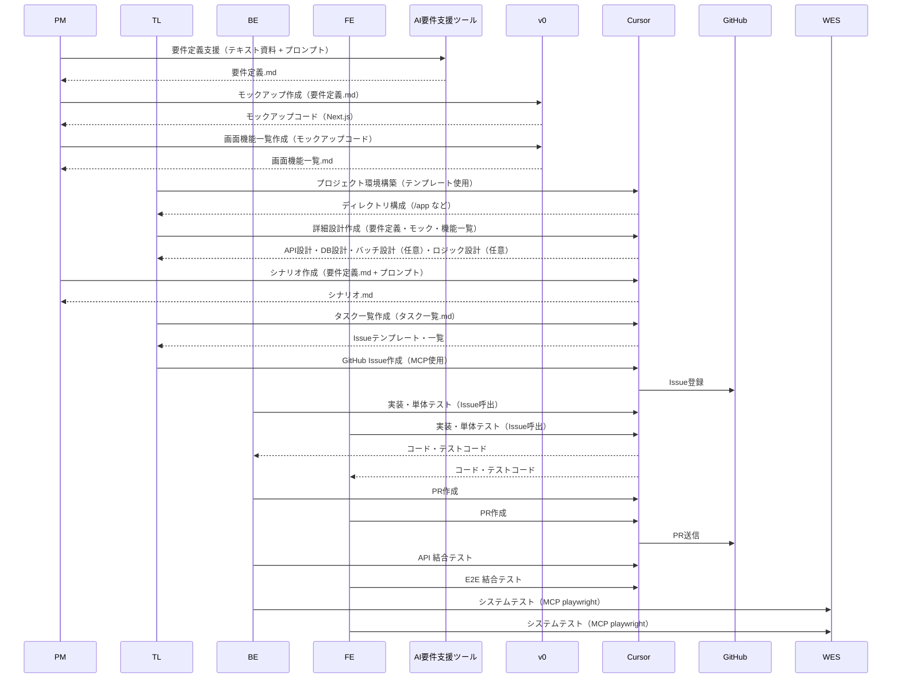

# AI駆動開発フロー（時系列順）

このプロセスは、企画・設計から始まり、開発、テスト、そしてリリースまでを順番に進めていきます。

---

### フェーズ1: 基本設計（PM）

#### 1.要件定義

- **担当:** PM  
- **内容:** `仕様書`を基に、ビジネス要件・機能要件を記載した `要件定義.md` を作成  
- **ツール:** `ChatGPT-o3` / `Gemini` / `Kiro`  
- **インプット:** `要件定義内容をまとめたテキスト資料`  
- **プロンプトテンプレート:**

```md
# ROLE
あなたはシニアITコンサルタント兼プロダクトマネージャーです。

# GOAL
以下の仕様書テキストを基に、Markdown 形式の「要件定義.md」を作成してください。

# INPUT
{{SPEC_TEXT}}

# OUTPUT REQUIREMENTS
- Markdown 形式・UTF‑8
- セクション構成（番号付き）:
  1. 目的（50〜80字）
  2. 背景（100〜150字）
  3. ビジネス要件
     - BR‑01, BR‑02 … （箇条書き）
  4. 機能要件
     - FR‑01, FR‑02 … （【対象画面／API】＋【内容】＋【優先度(High/Mid/Low)】）
  5. 非機能要件（性能・セキュリティ・運用）
  6. 想定ユーザー・ペルソナ
  7. 受入条件（Accept Criteria）
- すべて日本語。用語は一貫して正式名称を使用。
- 1項目につき原則 100 字以内。長い場合は適切に改行。

# STYLE
論点を漏れなく、重複なく。表現は簡潔に。
  
```
- **成果物:** `要件定義.md`

#### 2. モックアップ作成

- **担当:** PM  
- **内容:** AIツールを使って `モックアップ` を作成  
- **ツール:** `v0`  
- **インプット:** `要件定義.md`  
- **プロンプトテンプレート:**

```md
# ROLE
あなたはUI/UXデザイナー兼フロントエンドエンジニアです。

# GOAL
「要件定義.md」から Next.js + shadcn/ui 構成のモックアップコードを生成してください。

# INPUT
{{REQ_MD}}

# OUTPUT REQUIREMENTS
- 出力形式: ZIP ではなく“コードブロック付き Markdown”
- ディレクトリ構造:
  /app/(route)/page.tsx
  /components/{{ComponentName}}.tsx
  /lib/placeholder.ts
- 各ページにはダミーデータ取得関数 `getFakeData()` を置く
- UIルール:
  - Tailwind CSS
  - Card には `rounded-2xl` `shadow-md` を付与
  - 見出しは `text-xl font-semibold`
- コメントで TODO を残さない
- 日本語コメントは禁止（コード内は英語）

# STYLE
コード例と簡潔な説明を交互に。必要最小限の実装。

```


- **成果物:** `モックアップコード（Next.js）`

#### 3. 画面機能一覧作成

- **担当:** PM  
- **内容:** モックアップコードから `画面機能一覧.md` を生成  
- **ツール:** `v0`  
- **インプット:** `モックアップコード`  
- **プロンプトテンプレート:**
```md
# ROLE
あなたはプロダクトマネージャーです。

# GOAL
モックアップコードを解析し、画面単位の機能一覧を Markdown ファイルとしてまとめてください。

# INPUT
{{MOCKUP_CODE}}

# OUTPUT REQUIREMENTS
- テーブル形式（Markdown）
  | No | 画面ID | 画面名 | 主なコンポーネント | 主要アクション | API呼出 | 備考 |
- 行はモックアップ内のルート/Page単位で網羅
- 画面IDは `PG-###` の連番
- カラム幅は自動でOK。折り返しは `<br>` で調整。
- 日本語。動詞は「〜する」で統一。

# STYLE
漏れ・重複なし。API呼出は `GET /api/users` 形式で。


```
- **成果物:** `画面機能一覧.md`

---

### フェーズ2: 実装準備（BE / FE）

#### 4. プロジェクト環境構築

- **担当:** BE（TL）  
- **内容:** `Cursor`を用いてディレクトリテンプレートに沿った環境を構築  
- **成果物例:**


/app
/components
/pages
/api
/tests
README.md


#### 5. 詳細設計作成

- **担当:** TL  
- **内容:** モックアップを基に `詳細設計` を生成  
- **ツール:** `Cursor`  
- **インプット:** `要件定義.md` `フロントエンドコード` `画面機能一覧.md`
- **プロンプトテンプレート:** `XXXXXX`  
- **成果物:** `Swagger(API)設計``データベース(スキーマ)設計`'バッチ設計(optional)''詳細ロジックAPI設計(optional)'


#### 6.シナリオ作成

- **担当:** PM
- **内容:** 開発と並行して、テスト用の `シナリオ.md` を作成
- **ツール:** `Cursor`  
- **インプット:** `要件定義.md` 
- **プロンプトテンプレート:** `XXXXXX`  
- **成果物:** `シナリオ.md'


#### 7. 実装タスク一覧作成
- **担当:** TL
- **内容:** これまで作成した成果物からタスク一覧を作成する。
- **ツール:** `Cursor`  
- **参照:** `タスク一覧.md` `Issueテンプレート.md`
- **プロンプトテンプレート:** `XXXXXX`
- **成果物:** `シナリオ.md'

#### 8. Github_Issue作成
- **担当:** TL 
- **内容:** Github MCPを使って、タスク一覧からGithub Issue作成する。
- **ツール:** `Cursor(Github MCP)`  

---

### フェーズ3: 開発・単体テスト（BE & FE）

#### 9. 実装と単体テスト

- **担当:** BE / FE  
- **内容:** Github MCPを使って、担当のIssueを呼び出し、開発・単体テストを実装する。
- **ツール:** `Cursor(Github MCP)`  
- **成果物:** コード、テストコード

#### 10. PR作成

- **担当:** BE / FE  
- **内容:** 実装後に Github MCPを使って`PR（プルリクエスト）` を作成する。
- **ツール:** `Cursor(Github MCP)`  
- **成果物:** PR（プルリクエスト）

---

### フェーズ4: 結合・システムテスト

#### 11. 結合テスト（Integration Test）

- **担当:** BE / FE  
- **内容:** 担当範囲に応じて以下を並行実施：
- **ツール:** `Cursor`

BE: APIテスト（Cursor）
FE: E2Eテスト（Cursor）


#### システムテスト（System Test）

- **担当:** BE / FE  
- **内容:** 全体を通した最終確認  
- **ツール:** `Cursor(MCP playwright)`
- **インプット:** `シナリオ.md'
- **プロンプトテンプレート:** `XXXXXX`  
- **成果物:** `シナリオテストコード'

---

#### 開発フロー図


#### ディレクトリ構成テンプレート
```md
.
├── .editorconfig
├── .env.example                # ← 環境変数テンプレート
├── .eslintignore
├── .eslintrc.cjs               # ← Airbnb + Tailwind + Prettier
├── .gitignore
├── .prettierignore
├── .prettierrc.cjs
├── .commitlintrc.cjs           # ← Conventional Commits
├── next.config.mjs
├── package.json
├── pnpm-lock.yaml
├── README.md                   # ← プロジェクト概要テンプレート
├── tsconfig.json
│
├── app/                        # ── Front end (App Router)
│   ├── layout.tsx
│   ├── page.tsx
│   └── (auth)/page.tsx         # ← 例）/auth ルート
│
├── components/
│   ├── ui/                     # ← shadcn/ui で生成した汎用 UI
│   │   └── button.tsx
│   ├── Header.tsx
│   ├── Footer.tsx
│   └── index.ts                # ← barrel export
│
├── lib/                        # ── フロント共通ロジック
│   ├── api.ts                  # ← fetch ラッパ
│   ├── auth.ts                 # ← NextAuth Helpers
│   └── validators.ts
│
├── prisma/                     # ── DB スキーマ & Seed
│   ├── schema.prisma
│   └── seed.ts
│
├── scripts/                    # ── 補助スクリプト
│   └── generate-openapi.ts
│
├── public/                     # ── 静的アセット
│   └── favicon.ico
│
├── styles/
│   ├── globals.css
│   └── tailwind.css
│
├── tests/
│   ├── unit/                   # ← vitest or jest
│   ├── integration/
│   └── e2e/                    # ← Playwright
│       └── example.spec.ts
│
├── docs/                       # ── ドキュメント & プロンプト
│   ├── requirements/要件定義.md
│   ├── design/詳細設計.md
│   ├── prompts/                # ← 前回答で示した各種プロンプト
│   │   ├── 01_requirements_prompt.md
│   │   ├── 02_mockup_prompt.md
│   │   └── …
│   └── architecture.mmd        # ← Mermaid ER/Sequence
│
├── .github/
│   ├── ISSUE_TEMPLATE/
│   │   ├── bug_report.md
│   │   └── feature_request.md
│   ├── PULL_REQUEST_TEMPLATE.md
│   └── workflows/
│       ├── ci.yml              # ← Lint/Test/Build
│       └── release.yml         # ← タグで Cloud Run デプロイ
│
└── vercel.json                 # ← Vercel 用 (任意)

```

