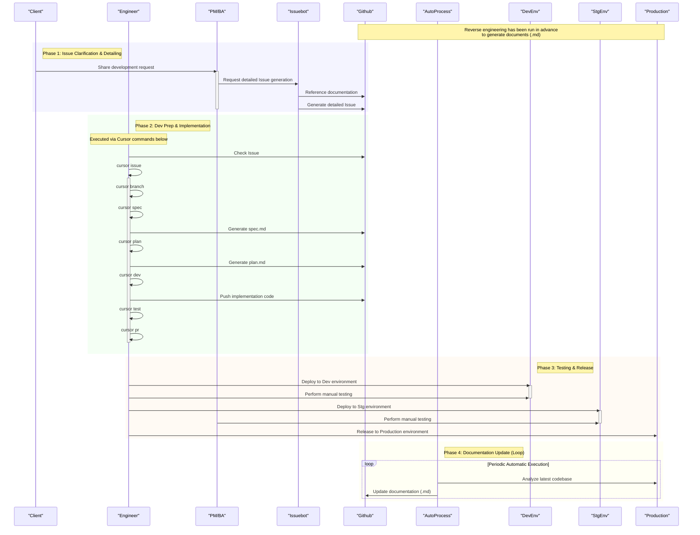

# 🤖 Cursor AI Development Workflow 📜

> This document defines a consistent development process, covering everything from client requests to release, and includes a self-evolving document management system.

---

### Phase 0: 🏛️ Foundation (Reverse Engineering)

This is the phase for laying the groundwork for the project.

-   **🔍 Project Analysis**: Reverse engineer the source code and behavior of the existing project.
-   **✍️ Document Generation**: Based on the analysis, document the entire project's specifications in **`Markdown (.md)`** format to establish an initial development baseline.

---

### Phase 1: 💡 Clarifying Issues

This phase transforms client requests into developable issues.

1.  **🗣️ Issue Occurrence**: The **Client** directly records development requests into the **`Issuebot`**.
2.  **⚙️ Automatic Issue Generation**: The **`Issuebot`** references the latest documentation to automatically generate a detailed **GitHub Issue** from the client's request.

> **Note**
> At this point, the necessary requirements, background, and objectives for development are consolidated in the Issue, unifying the understanding among all stakeholders.

---

### Phase 2: 🛠️ Development Preparation and Implementation

Engineers proceed with development by sequentially executing predefined `Cursor commands` within `Cursor`. The development process is structured by the following commands.

1.  **📥 Fetch Issue (with Branch Creation)**
    -   `/issue {issue_number}`
    -   Fetches the assigned Issue from GitHub, saves it locally as `issue.md`, and automatically creates a working branch following naming conventions.
    -   Options:
        -   `--auto` : Executes the full workflow automatically (issue → spec → plan → dev → test → pr)
        -   `--skip-spec --skip-plan` : Skips spec/plan for rapid development
2.  **📜 Create Spec**
    -   `/spec {issue_number}`
    -   Generates a **specification document (`spec.md`)** from a template based on `issue.md` to solidify functional requirements and UI/UX outlines.
3.  **🗺️ Create Plan**
    -   `/plan {issue_number}`
    -   Generates an **implementation plan (`plan.md`)** from a template based on `spec.md` to detail tasks and technical approaches.
4.  **💻 Implement**
    -   `/dev {issue_number}`
    -   Interactively proceeds with TDD or direct implementation according to `plan.md`.
5.  **🧪 Test**
    -   `/test {issue_number}`
    -   Executes tests for the implemented code and saves the results as evidence.
6.  **🚀 Create Pull Request**
    -   `/pr {issue_number}`
    -   Efficiently creates a **Pull Request** for the code that has passed tests, using a template.

---
#### **Command Details**

| Command  | Description |
| :--- | :--- |
| **issue** | Fetches GitHub issue information, saves it to `issue.md`, and creates a branch corresponding to the Issue. Supports `--auto` option for full pipeline execution, and `--skip-spec --skip-plan` for rapid development. |
| **spec** | Creates a specification document for the Issue. Uses `.cursor/templates/spec-template.md` to generate `spec.md` organizing requirements and criteria. |
| **plan** | Creates an implementation plan. Uses `.cursor/templates/plan-template.md` to generate `plan.md`, including directory structure and task breakdowns. |
| **dev** | Assists in the development phase. Uses `.cursor/templates/dev-template.md` to interactively develop code by choosing between TDD or direct implementation, including validation and refactoring. |
| **test** | Executes tests and saves the results. Identifies the framework, runs the tests, and saves logs and reports under `docs/issues/{issue_number}/evidence/`. |
| **pr** | Creates a Pull Request. Proceeds in three steps: ① Git status check and user approval, ② PR document creation (`pr.md`), ③ GitHub PR creation via `gh pr create`. |


---

### Phase 3: ✅ Testing and Release

This phase ensures quality and delivers the product to the production environment.

1.  **🧪 Engineer Testing (at Dev)**
    -   After implementation is complete, engineers perform basic operational checks in the `Dev environment`.
2.  **🚦 PM/BA Testing (at Stg)**
    -   In the `Stg environment`, the PM/BA performs a final confirmation to ensure it meets the client's required specifications.
3.  **🚀 Production Release**
    -   After clearing all tests, the changes are deployed to the `Production environment`, completing the release.

---

### Phase 4: 🔄 Self-Evolving Documentation

The development process itself builds a cycle for improving future development.

1.  **🤖 Periodic Automatic Execution**: After a release or on a regular schedule, **reverse engineering is automatically executed** on the latest codebase.
2.  **✨ Document Updates**: Based on the results, the **`.md` document set created in Phase 0 is automatically updated to the latest state**.

> **Point**
> This prevents the "outdating of documentation," a form of technical debt, and enables development to always be based on accurate information.

---
---

### 📊 Sequence Diagram



---

# 🤖 Cursor AI 開発フロー 📜

> このドキュメントは、クライアントの要望からリリース、そして自己進化するドキュメント管理までを網羅した、一貫性のある開発プロセスを定義します。

---

### Phase 0 : 🏛️ 基礎工事 (リバースエンジニアリング)

プロジェクト開始の土台を築くフェーズです。

-   **🔍 プロジェクトの解析**: 既存プロジェクトのソースコードや動作をリバースエンジニアリングします。
-   **✍️ ドキュメントの生成**: 解析結果を基に、プロジェクト全体の仕様を **`Markdown (.md)`** 形式でドキュメント化し、開発の初期ベースラインを確立します。

---

### Phase 1 : 💡 課題の具体化

クライアントの要望を、開発可能なIssueへと変換します。

1.  **🗣️ 課題の発生**: **クライアント**が開発要望を直接 **`Issuebot`** に記録します。
2.  **⚙️ Issueの自動生成**: **`Issuebot`** が、最新のドキュメントを参照し、クライアントの要望から詳細な **GitHub Issue** を自動で生成します。

> **Note**
> この時点で、開発に必要な要件、背景、目的がIssueに集約され、関係者全員の認識が統一されます。

---

### Phase 2 : 🛠️ 開発準備と実装

エンジニアが`Cursor`上で、定義済みの`Cursorコマンド`を順次実行して開発を進めます。開発プロセスは以下のコマンドで体系化されています。

1.  **📥 Issueの取得**
    -   `/cursor issue`
    -   アサインされたIssueを`issue.md`としてローカルに保存し、開発要件を正確に把握します。
2.  **🌿 ブランチの作成**
    -   `/cursor branch`
    -   Issueに対応する作業ブランチを、規約に沿って自動で作成します。
3.  **📜 Spec作成**
    -   `/cursor spec`
    -   `issue.md`を基にした**仕様書 (`spec.md`)** をテンプレートから生成し、機能要件やUI/UXの骨子を固めます。
4.  **🗺️ Plan作成**
    -   `/cursor plan`
    -   `spec.md`を基にした**実装計画書 (`plan.md`)** をテンプレートから生成し、タスクや技術的アプローチを具体化します。
5.  **💻 実装**
    -   `/cursor dev`
    -   `plan.md`に沿って、TDDまたは直接実装をインタラクティブに進めます。
6.  **🧪 テスト**
    -   `/cursor test`
    -   実装したコードのテストを実行し、結果をエビデンスとして保存します。
7.  **🚀 プルリクエスト作成**
    -   `>/cursor pr`
    -   テストをパスしたコードの**Pull Request**を、テンプレートを用いて効率的に作成します。

---
#### **コマンド詳細**

| コマンド | 概要 |
| :--- | :--- |
| **issue** | GitHub issue 情報を取得して `issue.md` に保存する。タイトル・本文・ラベル・担当者・状態などをまとめ、構造化したドキュメントを作成する。 |
| **branch** | Issue に対応する新しいブランチを作成する。未コミット変更がある場合は stash/discard/commit/cancel を選択させ、命名規則に従ったブランチ名で作成する。 |
| **spec** | Issue の仕様書を作成する。GitHub から Issue 情報を取得し、`.cursor/templates/spec-template.md` をもとに要件や基準を整理した `spec.md` を生成する。 |
| **plan** | 実装計画を作成する。Issue 情報を取得し、`.cursor/templates/plan-template.md` を利用してディレクトリ構造やタスク分解を含む `plan.md` を生成する。 |
| **dev** | 開発フェーズを支援する。`.cursor/templates/dev-template.md` を利用し、TDD か直接実装を選んでインタラクティブにコードを開発。検証・リファクタリングも含む。 |
| **test** | テストを実行して結果を保存する。フレームワークを特定しテストを実行、ログやレポートを `docs/issues/{issue_number}/evidence/` 以下に保存する。 |
| **pr** | Pull Request を作成する。3ステップで進行：①Git ステータス確認とユーザー承認、②PR ドキュメント作成 (`pr.md`)、③`gh pr create` による GitHub PR 作成。 |

---

### Phase 3 : ✅ テストとリリース

品質を保証し、成果物を本番環境へと届けます。

1.  **🧪 エンジニアによるテスト (at Dev)**
    -   実装完了後、`Dev環境`でエンジニアが基本的な動作確認を行います。
2.  **🚦 PM/BAによるテスト (at Stg)**
    -   `Stg環境`でPM/BAが、クライアントの要求仕様を満たしているか最終確認を行います。
3.  **🚀 本番リリース**
    -   全てのテストをクリアした後、`本番環境`へ反映し、リリースを完了します。

---

### Phase 4 : 🔄 自己進化するドキュメント

開発プロセス自体が、未来の開発をより良くするためのサイクルを構築します。

1.  **🤖 定期的な自動実行**: リリース後、または定期スケジュールで、最新のコードベースに対する**リバースエンジニアリングが自動実行**されます。
2.  **✨ ドキュメントの更新**: 実行結果を基に、**Phase0で作成された`.md`ドキュメント群が自動で最新の状態に更新**されます。

> **Point**
> これにより、「ドキュメントの陳腐化」という技術的負債を未然に防ぎ、常に正確な情報に基づいた開発が可能になります。

---
---

### 📊 シーケンス図

```mermaid
sequenceDiagram
    %% 人キャラクター (青系)
    participant Client as "Client" #B0C4DE
    participant Engineer as "Engineer" #87CEEB
    participant PMBA as "PM/BA" #1E90FF

    %% ツール/サービス (緑系)
    participant Issuebot as "Issuebot" #90EE90
    participant Github as "Github" #32CD32
    participant AutoProcess as "AutoProcess" #228B22

    %% 環境 (オレンジ系)
    participant DevEnv as "DevEnv" #FFD580
    participant StgEnv as "StgEnv" #FFB347
    participant Production as "Production" #FF8C00

    Note over Production,Github: 事前にリバースエンジニアリングを実行し\nドキュメント(.md)を生成済

    rect rgba(200, 200, 255, 0.2)
    Note right of Client: Phase 1: 課題整理と具体化
        Client->>PMBA: 開発要望を共有
        activate PMBA
        PMBA->>Issuebot: 詳細なIssue生成を依頼
        Issuebot->>Github: ドキュメントを参照
        Issuebot->>Github: 詳細なIssueを生成
        deactivate PMBA
    end

    rect rgba(200, 255, 200, 0.2)
    Note right of Engineer: Phase 2: 開発準備と実装
        Note over Engineer: 以下、Cursorコマンドで実行
        Engineer->>Github: Issueを確認
        Engineer->>Engineer: cursor issue
        activate Engineer
        Engineer->>Engineer: cursor branch
        Engineer->>Engineer: cursor spec
        Engineer->>Github: spec.md を生成
        Engineer->>Engineer: cursor plan
        Engineer->>Github: plan.md を生成
        Engineer->>Engineer: cursor dev
        Engineer->>Github: 実装コードをプッシュ
        Engineer->>Engineer: cursor test
        Engineer->>Engineer: cursor pr
        deactivate Engineer
    end

    rect rgba(255, 230, 200, 0.2)
    Note right of DevEnv: Phase 3: テストとリリース
        Engineer->>DevEnv: Dev環境へデプロイ
        activate DevEnv
        Engineer->>DevEnv: マニュアルテスト実施
        deactivate DevEnv

        Engineer->>StgEnv: Stg環境へデプロイ
        activate StgEnv
        PMBA->>StgEnv: マニュアルテスト実施
        deactivate StgEnv

        Engineer->>Production: 本番環境へリリース
    end

    rect rgba(255, 255, 200, 0.2)
    Note right of AutoProcess: Phase 4: ドキュメントの最新化 (ループ)
        loop 定期的な自動実行
            AutoProcess->>Production: 最新コードベースを解析
            AutoProcess->>Github: ドキュメント(.md)を最新化
        end
    end
