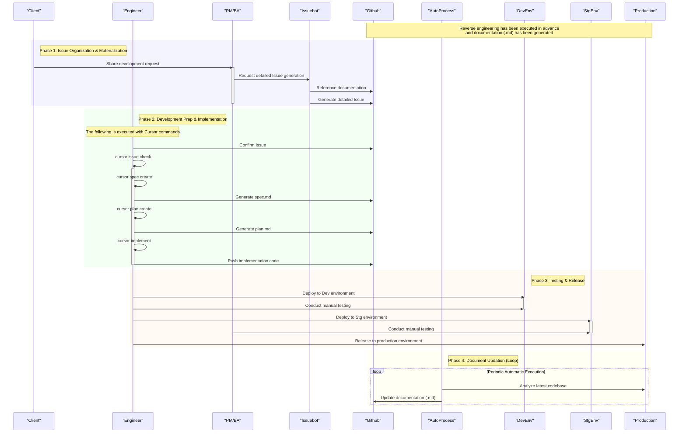

# 🤖 Cursor AI Development Flow 📜

> This document defines a consistent development process, covering everything from client requests to release and self-evolving document management.

---

### Phase 0 : 🏛️ Foundational Work (Reverse Engineering)

This phase lays the foundation for the project's start.

-   **🔍 Project Analysis**: Reverse engineer the source code and behavior of the existing project.
-   **✍️ Document Generation**: Based on the analysis, document the entire project's specifications in **`Markdown (.md)`** format to establish an initial development baseline.

---

### Phase 1 : 💡 Issue Materialization

Transforms client requests into developable Issues.

1.  **🗣️ Issue Creation**: The **Client** directly records development requests into **`Issuebot`**.
2.  **⚙️ Automatic Issue Generation**: **`Issuebot`** references the latest documentation and automatically generates a detailed **GitHub Issue** from the client's request.

> **Note**
> At this point, the requirements, background, and objectives necessary for development are consolidated into the Issue, unifying the understanding of all stakeholders.

---

### Phase 2 : 🛠️ Development Prep & Implementation

The engineer proceeds with development by sequentially executing predefined `Cursor commands` within `Cursor`.

1.  **📥 Fetching the Issue**
    -   `> cursor issue confirm`
    -   Fetches the assigned Issue into `Cursor` to accurately grasp the development requirements.
2.  **📜 Spec Creation**
    -   `> cursor spec create`
    -   Generates a **specification document (`spec.md`)** based on the Issue to solidify functional requirements and the UI/UX framework.
3.  **🗺️ Plan Creation**
    -   `> cursor plan create`
    -   Generates an **implementation plan (`plan.md`)** based on `spec.md` to flesh out tasks and technical approaches.
4.  **💻 Implementation**
    -   `> cursor implement`
    -   Starts **coding** according to `plan.md`.

---

### Phase 3 : ✅ Testing & Release

Ensures quality and delivers the final product to the production environment.

1.  **🧪 Testing by Engineer (at Dev)**
    -   After implementation is complete, the engineer performs basic operational checks in the `Dev environment`.
2.  **🚦 Testing by PM/BA (at Stg)**
    -   In the `Stg environment`, the PM/BA conducts a final check to ensure it meets the client's required specifications.
3.  **🚀 Production Release**
    -   After clearing all tests, the changes are deployed to the `production environment` to complete the release.

---

### Phase 4 : 🔄 Self-Evolving Documentation

The development process itself establishes a cycle for improving future development.

1.  **🤖 Periodic Automated Execution**: After a release or on a regular schedule, **reverse engineering is automatically performed** on the latest codebase.
2.  **✨ Document Updates**: Based on the results, the **`.md` documents created in Phase 0 are automatically updated to the latest state**.

> **Point**
> This prevents the technical debt of "outdated documentation" and enables development that is always based on accurate information.

---
---

### 📊 Sequence Diagram




# 🤖 Cursor AI 開発フロー 📜

> このドキュメントは、クライアントの要望からリリース、そして自己進化するドキュメント管理までを網羅した、一貫性のある開発プロセスを定義します。

---

### Phase 0 : 🏛️ 基礎工事 (リバースエンジニアリング)

プロジェクト開始の土台を築くフェーズです。

-   **🔍 プロジェクトの解析**: 既存プロジェクトのソースコードや動作をリバースエンジニアリングします。
-   **✍️ ドキュメントの生成**: 解析結果を基に、プロジェクト全体の仕様を **`Markdown (.md)`** 形式でドキュメント化し、開発の初期ベースラインを確立します。

---

### Phase 1 : 💡 課題の具体化

クライアントの要望を、開発可能なIssueへと変換します。

1.  **🗣️ 課題の発生**: **クライアント**が開発要望を直接 **`Issuebot`** に記録します。
2.  **⚙️ Issueの自動生成**: **`Issuebot`** が、最新のドキュメントを参照し、クライアントの要望から詳細な **GitHub Issue** を自動で生成します。

> **Note**
> この時点で、開発に必要な要件、背景、目的がIssueに集約され、関係者全員の認識が統一されます。

---

### Phase 2 : 🛠️ 開発準備と実装

エンジニアが`Cursor`上で、定義済みの`Cursorコマンド`を順次実行して開発を進めます。

1.  **📥 Issueの呼び出し**
    -   `> cursor issue confirm`
    -   アサインされたIssueを`Cursor`上に呼び出し、開発要件を正確に把握します。
2.  **📜 Spec作成**
    -   `> cursor spec create`
    -   Issueを基にした**仕様書 (`spec.md`)** を生成し、機能要件やUI/UXの骨子を固めます。
3.  **🗺️ Plan作成**
    -   `> cursor plan create`
    -   `spec.md`を基にした**実装計画書 (`plan.md`)** を生成し、タスクや技術的アプローチを具体化します。
4.  **💻 実装**
    -   `> cursor implement`
    -   `plan.md`に沿って**コーディング**を開始します。

---

### Phase 3 : ✅ テストとリリース

品質を保証し、成果物を本番環境へと届けます。

1.  **🧪 エンジニアによるテスト (at Dev)**
    -   実装完了後、`Dev環境`でエンジニアが基本的な動作確認を行います。
2.  **🚦 PM/BAによるテスト (at Stg)**
    -   `Stg環境`でPM/BAが、クライアントの要求仕様を満たしているか最終確認を行います。
3.  **🚀 本番リリース**
    -   全てのテストをクリアした後、`本番環境`へ反映し、リリースを完了します。

---

### Phase 4 : 🔄 自己進化するドキュメント

開発プロセス自体が、未来の開発をより良くするためのサイクルを構築します。

1.  **🤖 定期的な自動実行**: リリース後、または定期スケジュールで、最新のコードベースに対する**リバースエンジニアリングが自動実行**されます。
2.  **✨ ドキュメントの更新**: 実行結果を基に、**Phase0で作成された`.md`ドキュメント群が自動で最新の状態に更新**されます。

> **Point**
> これにより、「ドキュメントの陳腐化」という技術的負債を未然に防ぎ、常に正確な情報に基づいた開発が可能になります。

---
---

### 📊 シーケンス図

```mermaid
sequenceDiagram
    %% 人キャラクター (青系)
    participant Client as "Client" #B0C4DE
    participant Engineer as "Engineer" #87CEEB
    participant PMBA as "PM/BA" #1E90FF

    %% ツール/サービス (緑系)
    participant Issuebot as "Issuebot" #90EE90
    participant Github as "Github" #32CD32
    participant AutoProcess as "AutoProcess" #228B22

    %% 環境 (オレンジ系)
    participant DevEnv as "DevEnv" #FFD580
    participant StgEnv as "StgEnv" #FFB347
    participant Production as "Production" #FF8C00

    Note over Production,Github: 事前にリバースエンジニアリングを実行し\nドキュメント(.md)を生成済

    rect rgba(200, 200, 255, 0.2)
    Note right of Client: Phase 1: 課題整理と具体化
        Client->>PMBA: 開発要望を共有
        activate PMBA
        PMBA->>Issuebot: 詳細なIssue生成を依頼
        Issuebot->>Github: ドキュメントを参照
        Issuebot->>Github: 詳細なIssueを生成
        deactivate PMBA
    end

    rect rgba(200, 255, 200, 0.2)
    Note right of Engineer: Phase 2: 開発準備と実装
        Note over Engineer: 以下、Cursorコマンドで実行
        Engineer->>Github: Issueを確認
        Engineer->>Engineer: cursor issue check
        activate Engineer
        Engineer->>Engineer: cursor spec create
        Engineer->>Github: spec.md を生成
        Engineer->>Engineer: cursor plan create
        Engineer->>Github: plan.md を生成
        Engineer->>Engineer: cursor implement
        Engineer->>Github: 実装コードをプッシュ
        deactivate Engineer
    end

    rect rgba(255, 230, 200, 0.2)
    Note right of DevEnv: Phase 3: テストとリリース
        Engineer->>DevEnv: Dev環境へデプロイ
        activate DevEnv
        Engineer->>DevEnv: マニュアルテスト実施
        deactivate DevEnv

        Engineer->>StgEnv: Stg環境へデプロイ
        activate StgEnv
        PMBA->>StgEnv: マニュアルテスト実施
        deactivate StgEnv

        Engineer->>Production: 本番環境へリリース
    end

    rect rgba(255, 255, 200, 0.2)
    Note right of AutoProcess: Phase 4: ドキュメントの最新化 (ループ)
        loop 定期的な自動実行
            AutoProcess->>Production: 最新コードベースを解析
            AutoProcess->>Github: ドキュメント(.md)を最新化
        end
    end
