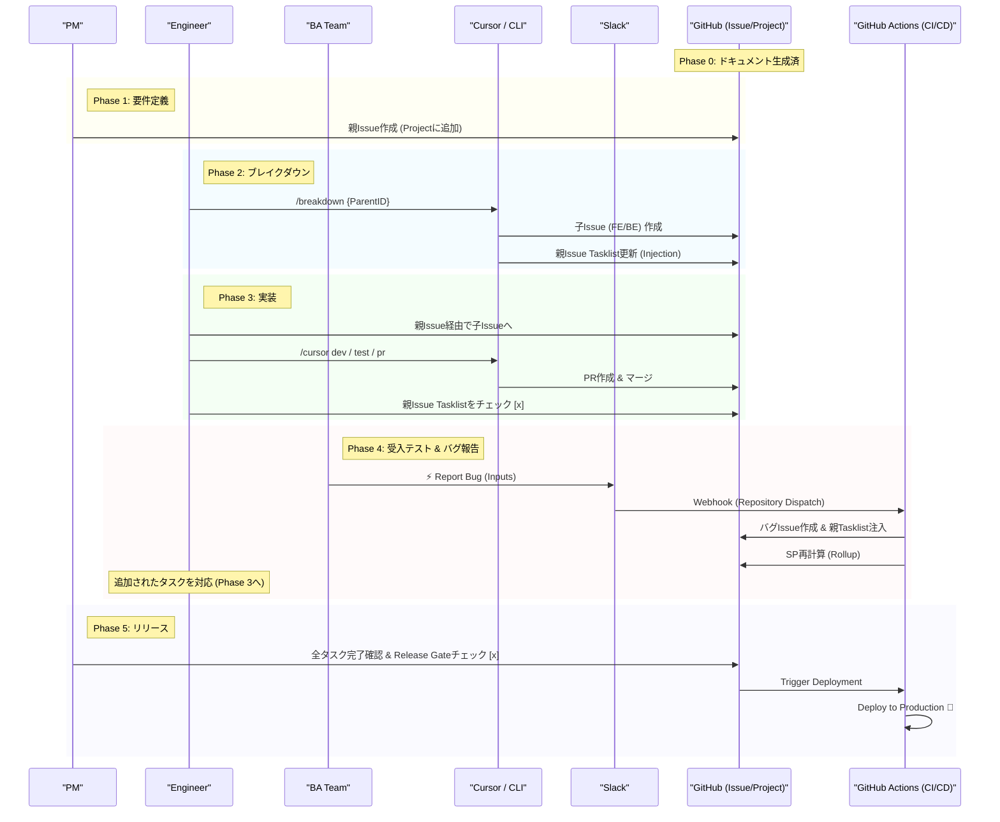

# 🤖 Cursor AI Modern Development Flow 📜

> このドキュメントは、**「管理コストの最小化」**と**「実績データの透明化」**を両立する、最新のCursor駆動開発プロセスを定義します。
> GitHub Projectには「親課題」のみを表示し、実装やバグ修正はすべて「子課題」として親に注入（Injection）される構造を採用しています。

---

### Phase 0 : 🏛️ 基礎工事 (リバースエンジニアリング)

プロジェクト開始の土台を築くフェーズです。

* **🔍 プロジェクトの解析**: 既存プロジェクトのソースコードや動作をリバースエンジニアリングします。
* **✍️ ドキュメントの生成**: 解析結果を基に、プロジェクト全体の仕様を **`Markdown (.md)`** 形式でドキュメント化し、開発の初期ベースラインを確立します。

---

### Phase 1 : 📝 要件定義と親課題作成

プロジェクトボードの視認性を保つため、PMが管理単位となる「親Issue」を作成します。

1. **🗣️ 親Issueの作成**: **PM** が機能要件をまとめた **Parent Issue** を作成します。
* GitHub Project Boardに表示されるのは、このIssueのみです。
* 初期状態ではSP（Story Point）は空、または概算です。

2. **📋 ステータス遷移**: 仕様が固まり次第、開発チームへアサインし、ステータスを `Ready` に変更します。

---

### Phase 2 : 🧩 技術設計とブレイクダウン

エンジニアは親Issueを受け取り、Cursor上のコマンドでタスクを分解・注入します。

1. **🔨 ブレイクダウン**: エンジニアは以下のコマンドを実行します。
* `/breakdown {ParentID}`
* **自動処理**: FE（フロントエンド）とBE（バックエンド）の実装用Issueが作成され、**親IssueのTasklistに自動的にリンクが追記**されます。
* *※子Issue自体はProject Boardには表示されません。*

2. **🗺️ Plan作成**:
* `/plan {ParentID}`
* AIが親Issueの要件を読み込み、技術的な実装計画書（`plan.md`）のドラフトを作成します。

---

### Phase 3 : 💻 実装 (Child Issue Driven)

エンジニアはProject Board上の親Issueを経由して、個別の子Issueに取り組みます。

1. **📥 タスク着手**: 親IssueのTasklistから、自分の担当（FE/BE）のリンクをクリックして子Issueへ移動します。
2. **🛠️ 実装サイクル**:
* `/cursor dev`: 子Issue上でブランチを作成し、`plan.md` に沿ってTDDまたは直接実装を行います。
* `/cursor test`: 実装コードのテストを実行し、エビデンスを保存します。
* `/cursor pr`: 実装完了後、PRを作成してマージします。

3. **✅ 完了同期**: 子IssueがCloseされたら、**親Issueに戻りTasklistのチェックボックスを手動でON** にします。

---

### Phase 4 : 🕵️‍♀️ 受入テストとバグ報告 (BA Team)

BA（Business Analyst）チームによる検証フェーズです。不具合は「新しい子課題」として注入されます。

1. **⚡️ Slack報告**: BAは検証中に不具合や仕様変更を見つけた場合、Slackの `⚡️ Report Bug` ワークフローから報告します。
* 入力: 親Issue番号、内容、想定SP。

2. **💉 自動インジェクション**:
* GitHub Actionsが起動し、修正用Issueを自動作成。
* 親IssueのTasklist末尾に即座に追加されます。
* **SP Rollup**: 追加されたSPは親Issueの `Total SP` に自動加算されます。

3. **🔄 修正対応**: エンジニアは追加されたタスクをPhase 3と同様に処理します。

---

### Phase 5 : 🚀 リリース (Release Gate)

承認とデプロイのプロセスです。

1. **🚪 Release Gate確認**:
* PM/エンジニアは親IssueのTasklist（FE, BE, BA指摘分）が全て `[x]` であることを確認します。
* 「Deploy Gate」のチェックボックスをONにします。

2. **🤖 CI/CD自動発火**:
* 全てのチェックが埋まった瞬間、GitHub Actionsがトリガーされ、開発環境へのデプロイパイプラインが自動実行されます。

---

### Phase 6 : 🔄 自己進化するドキュメント

開発完了後、次期開発のためにドキュメントを最新化します。

1. **🤖 定期的な自動実行**: リリース後、最新のコードベースに対するリバースエンジニアリングが自動実行されます。
2. **✨ ドキュメントの更新**: Phase 0の `.md` ドキュメント群が自動更新され、仕様書とコードの乖離を防ぎます。

---

#### **コマンド詳細 (Cursor / Slack)**

| 実行環境 | コマンド / Action | 概要 |
| --- | --- | --- |
| **Cursor** | `/breakdown {id}` | 親Issueに対してFE/BEタスクを作成し、Tasklistに注入する。 |
| **Cursor** | `/plan {id}` | AIが要件を解析し、実装計画 (`plan.md`) を生成する。 |
| **Cursor** | `/cursor dev` | 開発支援。TDD/実装を選択しインタラクティブにコーディング。 |
| **Cursor** | `/cursor test` | テストを実行し、結果をログとして保存する。 |
| **Cursor** | `/cursor pr` | PRドキュメント作成から `gh pr create` までを自動化。 |
| **Slack** | `⚡️ Report Bug` | BA用。フォーム入力内容をGitHub Issue化し、親Issueに注入・SP加算する。 |

---

### 📊 シーケンス図

