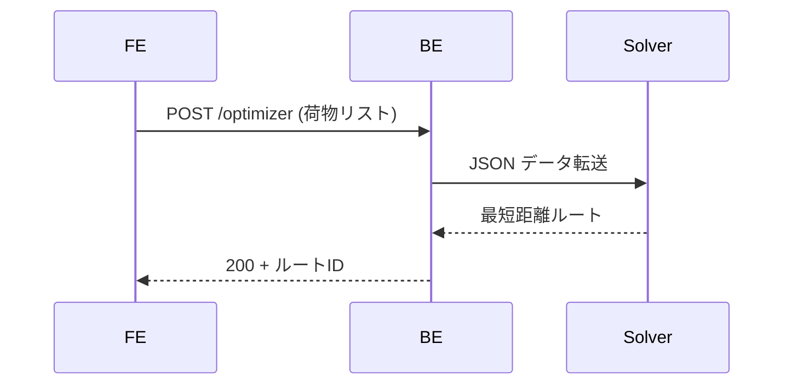

# Sample
## ロジック：ルート最適化（Simplified VRP）

```mermaid
sequenceDiagram
  participant FE
  participant BE
  participant Solver
  FE->>BE: POST /optimizer (荷物リスト)
  BE->>Solver: JSON データ転送
  Solver-->>BE: 最短距離ルート
  BE-->>FE: 200 + ルートID
```
## アルゴリズム概要
- 各配送先ノードを K-means でクラスタリング
- クラスタ単位で 2-opt 法により走行距離を短縮
- 総距離がしきい値以下で収束 → 結果返却
