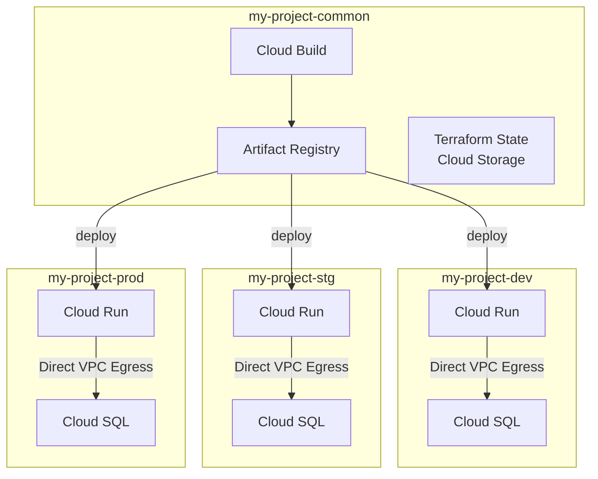

> **言語 / Language**: [🇻🇳 Tiếng Việt](#tiếng-việt) | [🇯🇵 日本語](#日本語)

---

# Tiếng Việt

*Vietnamese / ベトナム語*

## Mục lục

- [Phạm vi](#phạm-vi)
- [Mục tiêu](#mục-tiêu)
- [0. Quy tắc đặt tên dự án](#0-quy-tắc-đặt-tên-dự-án)
- [1. Cấu trúc dự án](#1-cấu-trúc-dự-án)
- [2. Tài nguyên sử dụng](#2-tài-nguyên-sử-dụng)
  - [Tier tài nguyên](#tier-tài-nguyên)
  - [Nhãn dự án GCP](#nhãn-dự-án-gcp)
  - [Thông số Tier1](#thông-số-tier1-high-traffic)
  - [Thông số Tier2](#thông-số-tier2-limited)
  - [Thông số Tier3](#thông-số-tier3-small)
  - [Tài nguyên dùng chung](#tài-nguyên-dùng-chung-không-phụ-thuộc-tier)
- [3. Kiến trúc hệ thống](#3-kiến-trúc-hệ-thống)
- [4. Quy tắc vận hành](#4-quy-tắc-vận-hành)
- [5. Quản lý IAM](#5-quản-lý-iam)
- [6. Quản lý IaC (Terraform)](#6-quản-lý-iac-terraform)
- [7. CI/CD và Service Account](#7-cicd-và-service-account)
- [8. Bí mật (Secrets)](#8-bí-mật-secrets)
- [Tài liệu liên quan](#tài-liệu-liên-quan)

---

## Phạm vi

Quy định nội bộ về triển khai lên Google Cloud Platform (GCP).  
Áp dụng cho tất cả các trường hợp triển khai ứng dụng và hạ tầng lên các dự án GCP do công ty quản lý (bao gồm tạo mới, thay đổi và xóa).

## Mục tiêu

- Thống nhất quy trình, trách nhiệm và tiêu chuẩn tối thiểu khi deploy lên GCP.
- Giảm rủi ro (truy cập, chi phí, sự cố môi trường production).

## 0. Quy tắc đặt tên dự án

### Định dạng

```
{org-prefix}-{service}-{env}
```

| Thành phần | Mô tả | Ví dụ |
|------------|-------|-------|
| `org-prefix` | Tên viết tắt của tổ chức / bộ phận (chữ thường, cho phép dấu gạch ngang) | `veho` |
| `service` | Tên sản phẩm / dịch vụ (chữ thường, cho phép dấu gạch ngang) | `kumu` |
| `env` | Môi trường (`dev` / `stg` / `prod` / `common`) | `prod` |

**Ví dụ:** `veho-kumu-dev`, `veho-kumu-prod`, `veho-kumu-common`

**Ràng buộc:**
- Tất cả chữ thường, phân cách bằng dấu gạch ngang (không dùng gạch dưới)
- Tối đa 30 ký tự (giới hạn Project ID của GCP)
- Không bắt đầu bằng số

## 1. Cấu trúc dự án

Áp dụng cấu trúc **4 dự án** sau đây:

| Dự án | Mục đích | Quyền truy cập thường xuyên |
|-------|----------|-----------------------------|
| `my-project-dev` | Phát triển và thử nghiệm | Cho phép rộng rãi (roles/editor) |
| `my-project-stg` | Kiểm tra cuối trước production | Chỉ đọc thường xuyên; ghi cần phê duyệt |
| `my-project-prod` | Môi trường production | Về nguyên tắc bằng không (JIT qua PAM) |
| `my-project-common` | CI/CD, Artifact Registry, Terraform state | Chỉ SA của CI/CD và SRE |

## 2. Tài nguyên sử dụng

Kiến trúc mục tiêu dựa trên **Cloud Run** (không sử dụng Compute Engine).

```
Cloud Build (build)
  ↓
Artifact Registry (lưu image)
  ↓
Cloud Run (thực thi ứng dụng)
  ↓ Direct VPC Egress
Cloud SQL (cơ sở dữ liệu)
```

> **Lưu ý**: Không sử dụng Compute Engine. Nếu Compute Engine xuất hiện trong hóa đơn, hãy kiểm tra xem có đang dùng Serverless VPC Access Connector không → chuyển sang **Direct VPC Egress**.

---

### Tier tài nguyên

Chọn Tier dựa trên đặc điểm dịch vụ. Tier được ghi trong `environments/{env}/main.tf` và áp dụng cho toàn bộ môi trường prod / stg / dev.

#### Định nghĩa Tier

| Tier | Tên | Đối tượng | Chi phí prod/tháng |
|---|---|---|---|
| **Tier1** | High Traffic | Production truy cập thường xuyên. Stg cũng luôn hoạt động | ~$316 |
| **Tier2** | Limited | Production truy cập hạn chế. Stg chỉ dùng khi điều tra/test | ~$108 |
| **Tier3** | Small | Hệ thống nhỏ · công cụ nội bộ · PoC | ~$16 |
| **Tier4** | On-Demand | Công cụ truy cập không thường xuyên · PoC giai đoạn đầu. Chỉ dành cho dev / stg (cấm áp dụng prod) | —（cấm áp dụng prod） |

#### Hướng dẫn chọn Tier

```
Truy cập thường xuyên và Stg cũng cần luôn hoạt động?
  → Tier1

Production đang vận hành nhưng truy cập hạn chế?
  → Tier2

Hệ thống nhỏ · công cụ nội bộ · PoC?
  → Tier3

Truy cập không thường xuyên và chấp nhận cold start 30〜90 giây?
  → Tier4 (chỉ dev / stg. prod dùng Tier3 trở lên)
```

#### Quy tắc thay đổi Tier

| Quy tắc | Nội dung |
|---|---|
| **Nâng Tier** | Khi lưu lượng tăng hoặc yêu cầu SLA cao hơn → PR + review |
| **Hạ Tier** | Mục đích giảm chi phí → PR + review bởi SRE |
| **Nâng Tier khẩn cấp** | Kỹ sư trực có thể thực hiện ngay; PR phải tạo vào ngày làm việc kế tiếp |
| **Ghi nhận thay đổi** | Ghi lý do và thời gian vào kênh Slack `#infra-ops` |

---

### Nhãn dự án GCP

Tất cả các dự án GCP phải được gắn nhãn theo bảng dưới đây. Nhãn được dùng để hiển thị chi phí, lọc danh sách dự án và cấu hình phạm vi cảnh báo ngân sách.

#### Nhãn bắt buộc

| Khóa | Ví dụ | Mô tả |
|---|---|---|
| `org` | `veho` | Tên viết tắt của tổ chức / bộ phận |
| `service` | `kumu` | Tên sản phẩm / dịch vụ |
| `env` | `dev` / `stg` / `prod` / `common` | Môi trường |
| `tier` | `tier1` / `tier2` / `tier3` / `tier4` | Tier tài nguyên（Tier4 chỉ áp dụng cho dev / stg） |

#### Ví dụ Terraform

```hcl
# environments/{env}/main.tf
resource "google_project" "this" {
  name       = var.project_id
  project_id = var.project_id

  labels = {
    org     = "veho"
    service = var.service_name
    env     = var.env   # dev / stg / prod / common
    tier    = var.tier  # tier1 / tier2 / tier3 / tier4
  }
}
```

Biến `tier` nên được giới hạn bằng khối `validation`:

```hcl
# modules/app/variables.tf
variable "tier" {
  type        = string
  description = "Tier tài nguyên (tier1 / tier2 / tier3 / tier4)"
  validation {
    condition     = contains(["tier1", "tier2", "tier3", "tier4"], var.tier)
    error_message = "tier phải là một trong: tier1 / tier2 / tier3 / tier4."
  }
}
```

#### Lệnh kiểm tra theo nhãn

```bash
# Danh sách dự án Tier1
gcloud projects list --filter="labels.tier=tier1"

# Danh sách dự án theo service
gcloud projects list --filter="labels.service=kumu"
```

> **Lưu ý**: Nhãn là metadata tùy chọn, độc lập với Project ID. Hãy quản lý nhất quán với quy tắc đặt tên Project ID (`{org-prefix}-{service}-{env}`).

---

### Quy tắc đặt tên

| Tài nguyên | Định dạng | Ví dụ |
|---|---|---|
| Cloud Run | `{service}-{component}` | `kumu-api` |
| Cloud SQL | `{service}-{engine}-{env}` | `kumu-pg-prod` |
| Cloud Build trigger | `{service}-{branch}-build` | `kumu-main-build` |
| Artifact Registry | `{service}-docker` | `kumu-docker` |
| Cloud Storage bucket | `{project-id}-{dùng cho}` | `veho-kumu-prod-assets` |
| VPC | `{project-id}-vpc` | `veho-kumu-prod-vpc` |

---

### Thông số Tier1 (High Traffic)

**Đối tượng**: Production truy cập thường xuyên. Stg cũng luôn hoạt động.

> **Lưu ý**: Chi phí ước tính. Thực tế phụ thuộc vào lưu lượng, dung lượng và hợp đồng. Xem [trang giá GCP](https://cloud.google.com/pricing).

| Danh mục | Thông số | dev | stg | prod |
|---|---|---|---|---|
| **Cloud Run** | CPU | 1 | 2 | 2 |
| | Memory | 512Mi | 1Gi | 1Gi |
| | min-instances | 0 (tự động dừng đêm) | 1 (luôn hoạt động) | 1 |
| | max-instances | 3 | 5 | 10 |
| | Timeout | 60s | 300s | 300s |
| | Concurrency | 80 | 80 | 80 |
| **Cloud SQL** | Machine type | db-n1-standard-1 | db-n1-standard-1 | db-n1-standard-1 |
| | Storage | 10GB (HDD) | 20GB (SSD) | 100GB (SSD, tự động mở rộng) |
| | HA | Không | Không | Có (failover replica) |
| | Backup | Không | Hàng ngày | Hàng ngày + PITR |
| | Lịch hoạt động | Ngày làm việc 08:00–22:00 | Luôn hoạt động | Luôn hoạt động |
| **Chi phí/tháng** | Cloud Run | ~$3 | ~$133 | ~$135 |
| | Cloud SQL | ~$31 | ~$77 | ~$180 |
| | Networking | ~$1 | ~$1 | ~$1 |
| | **Tổng** | **~$35** | **~$211** | **~$316** |

---

### Thông số Tier2 (Limited)

**Đối tượng**: Production đang vận hành nhưng truy cập hạn chế. Stg chỉ dùng khi điều tra/test.

| Danh mục | Thông số | dev | stg | prod |
|---|---|---|---|---|
| **Cloud Run** | CPU | 1 | 1 | 1 |
| | Memory | 512Mi | 512Mi | 512Mi |
| | min-instances | 0 (tự động dừng đêm) | 0 (tự động dừng đêm) | 1 |
| | max-instances | 3 | 3 | 5 |
| | Timeout | 60s | 60s | 300s |
| | Concurrency | 80 | 80 | 80 |
| **Cloud SQL** | Machine type | db-g1-small | db-g1-small | db-g1-small |
| | Storage | 10GB (HDD) | 20GB (SSD) | 20GB (SSD) |
| | HA | Không | Không | Không |
| | Backup | Không | Hàng ngày | Hàng ngày |
| | Lịch hoạt động | Ngày làm việc 08:00–22:00 | Ngày làm việc 08:00–22:00 | Luôn hoạt động |
| **Chi phí/tháng** | Cloud Run | ~$3 | ~$8 | ~$67 |
| | Cloud SQL | ~$16 | ~$18 | ~$40 |
| | Networking | ~$1 | ~$1 | ~$1 |
| | **Tổng** | **~$20** | **~$27** | **~$108** |

---

### Thông số Tier3 (Small)

**Đối tượng**: Hệ thống nhỏ · công cụ nội bộ · PoC.

| Danh mục | Thông số | dev | stg | prod |
|---|---|---|---|---|
| **Cloud Run** | CPU | 1 | 1 | 1 |
| | Memory | 256Mi | 256Mi | 256Mi |
| | min-instances | 0 (tự động dừng đêm) | 0 (tự động dừng đêm) | 0 |
| | max-instances | 2 | 2 | 2 |
| | Timeout | 60s | 60s | 300s |
| | Concurrency | 80 | 80 | 80 |
| **Cloud SQL** | Machine type | db-f1-micro | db-f1-micro | db-f1-micro |
| | Storage | 10GB (HDD) | 10GB (HDD) | 10GB (HDD) |
| | HA | Không | Không | Không |
| | Backup | Không | Không | Không |
| | Lịch hoạt động | Ngày làm việc 08:00–22:00 | Ngày làm việc 08:00–22:00 | Luôn hoạt động |
| **Chi phí/tháng** | Cloud Run | ~$2 | ~$2 | ~$3 |
| | Cloud SQL | ~$6 | ~$6 | ~$12 |
| | Networking | ~$0.5 | ~$0.5 | ~$1 |
| | **Tổng** | **~$8** | **~$8** | **~$16** |

---

### Thông số Tier4 (On-Demand)

**Đối tượng**: Công cụ truy cập không thường xuyên · PoC giai đoạn đầu. **Chỉ dành cho dev / stg**. Cấm áp dụng cho môi trường prod.

> **Lưu ý**: Cloud SQL được khởi động tự động qua API khi Cloud Run cold start, nên response đầu tiên có thể mất 30〜90 giây. Môi trường prod hãy chọn Tier3 trở lên.

| Danh mục | Thông số | dev | stg |
|---|---|---|---|
| **Cloud Run** | CPU | 1 | 1 |
| | Memory | 256Mi | 256Mi |
| | min-instances | 0 (cold start hoàn toàn) | 0 (cold start hoàn toàn) |
| | max-instances | 2 | 2 |
| | Timeout | 120s (bao gồm thời gian chờ SQL) | 120s (bao gồm thời gian chờ SQL) |
| | Concurrency | 80 | 80 |
| **Cloud SQL** | Machine type | db-f1-micro | db-f1-micro |
| | Storage | 10GB (HDD) | 10GB (HDD) |
| | HA | Không | Không |
| | Backup | Không | Không |
| | Cách khởi động | Liên động với Cloud Run qua API | Liên động với Cloud Run qua API |
| | Cách dừng | Cloud Scheduler (ban đêm · cuối tuần) | Cloud Scheduler (ban đêm · cuối tuần) |
| **Chi phí/tháng** | Cloud Run | ~$1 | ~$1 |
| | Cloud SQL | ~$1 | ~$1 |
| | Networking | ~$0.5 | ~$0.5 |
| | **Tổng** | **~$2.5** | **~$2.5** |

**【Ràng buộc riêng của Tier4】**

- SA của Cloud Run cần có quyền `cloudsql.instances.update`
- Script entrypoint của container gọi Cloud SQL Admin API, chờ đến khi trạng thái `RUNNABLE` rồi mới khởi động ứng dụng
- Đặt timeout từ 120s trở lên (SQL khởi động tối đa 60s + khởi động app + thời gian xử lý)
- Thông báo cho stakeholder về việc response đầu tiên sẽ chậm hơn

---

### Tài nguyên dùng chung (không phụ thuộc Tier)

Cloud Build, Artifact Registry, Cloud Storage, Networking dùng cấu hình chung cho tất cả các Tier.

#### Cloud Build

**Mục đích**: Pipeline CI/CD (môi trường common)

| Thông số | Giá trị |
|---|---|
| Machine type | E2_MEDIUM |
| Timeout | 20 phút |
| Lưu log | Cloud Storage (`{project-id}-cloudbuild-logs`) |
| **Chi phí ước tính / tháng** | **~$0** (trong hạn mức miễn phí) |

> Miễn phí 120 phút/ngày (3.600 phút/tháng). Giả sử 20 build/ngày × 5 phút = 100 phút/ngày → nằm trong hạn mức. Vượt hạn mức: $0.003/phút.

#### Artifact Registry

**Mục đích**: Lưu trữ container image (môi trường common)

| Thông số | Giá trị |
|---|---|
| Định dạng | Docker |
| Region | asia-northeast1 |
| Chính sách giữ image | Giữ 10 image mới nhất, tự động xóa cũ |
| **Chi phí ước tính / tháng** | **~$1** |

> Đơn giá: $0.10/GB/tháng. Giả sử 10 image × trung bình 1GB. Truyền dữ liệu trong cùng region miễn phí.

#### Cloud Storage

**Mục đích**: File tĩnh / Terraform state (môi trường common / prod)

| Thông số | Giá trị |
|---|---|
| Region | asia-northeast1 |
| Storage class | STANDARD |
| Versioning | Chỉ bật cho bucket Terraform state |
| Public access | Chặn hoàn toàn (asset tĩnh chỉ qua CDN) |
| **Chi phí ước tính / tháng** | **~$2** |

> Đơn giá: STANDARD $0.020/GB/tháng. Giả sử 100GB static assets. Terraform state và Cloud Build logs < 1GB nên không đáng kể.

#### Networking

**Mục đích**: VPC / Cloud NAT (tất cả môi trường)

| Thông số | Giá trị |
|---|---|
| Chế độ VPC | Custom mode (1 project – 1 VPC) |
| Subnet | asia-northeast1, `/24` |
| Kết nối internet | Cloud NAT (chỉ outbound) |
| Phương thức kết nối Cloud Run | Direct VPC Egress (không dùng Serverless VPC Access Connector) |
| **Chi phí ước tính / tháng** | **~$4** (tổng tất cả môi trường) |

> Cloud NAT gateway $0.0014/h × 720h ≈ $1/môi trường. dev/stg/prod cộng lại ~$3 + phí xử lý dữ liệu $0.045/GB.

## 3. Kiến trúc hệ thống

### Sơ đồ tổng thể



### Luồng CI/CD

```
Developer push code
  ↓
Cloud Build trigger (my-project-common)
  ↓
Build & push image → Artifact Registry
  ↓
Deploy Cloud Run (dev → stg → prod)
  ↓ Direct VPC Egress
Cloud SQL (mỗi môi trường độc lập)
```

### Điểm chính của kiến trúc

- **Không sử dụng Compute Engine** — tất cả workload chạy trên Cloud Run (serverless).
- **Direct VPC Egress** — kết nối Cloud Run với Cloud SQL không qua Connector.
- **my-project-common** — hub trung tâm cho CI/CD và lưu trữ artifact; không chứa workload ứng dụng.
- Mỗi môi trường (dev / stg / prod) hoàn toàn độc lập về dự án GCP.

## 4. Quy tắc vận hành

### Lịch hoạt động theo môi trường

| Môi trường | Cloud Run | Cloud SQL | Lịch hoạt động | Ghi chú |
|---|---|---|---|---|
| `dev` | Ngày làm việc 08:00–22:00 JST | Ngày làm việc 08:00–22:00 JST | Tự động dừng ban đêm và cuối tuần | Cloud SQL liên động khởi động khi Cloud Run khởi động |
| `stg` | Ngày làm việc 08:00–22:00 JST | Ngày làm việc 08:00–22:00 JST | Tự động dừng ban đêm và cuối tuần | Có thể gia hạn thủ công trước khi release |
| `prod` | 24/7 | 24/7 | Luôn hoạt động | Cấm scale-to-zero |
| `common` | — | — | Theo yêu cầu (chỉ khi CI/CD chạy) | Cloud Build tính phí theo sử dụng |

### Cơ chế tự động dừng / khởi động

- **dev / stg**: Cloud Scheduler đặt Cloud Run `--min-instances=0` lúc 22:00 JST mỗi ngày; khôi phục lúc 08:00 JST vào các ngày làm việc.
- Cloud SQL được khởi động tự động qua Cloud SQL Admin API khi Cloud Run cold start. Script entrypoint của container chờ đến khi trạng thái `RUNNABLE` rồi mới khởi động ứng dụng. Việc dừng Cloud SQL được thực hiện bởi Cloud Scheduler vào ban đêm và cuối tuần.
- Nếu tự động dừng / khởi động thất bại sẽ gửi cảnh báo qua Slack.

### Xử lý ngoại lệ khẩn cấp

- Kỹ sư trực (on-call) có thể khởi động thủ công `dev` / `stg` ngoài giờ quy định.
- Lịch tự động sẽ tiếp tục vào ngày làm việc tiếp theo.

## 5. Quản lý IAM

### Nguyên tắc cơ bản

- **Cấm ràng buộc trực tiếp cho cá nhân**: tất cả phải thông qua Google Groups.
- **Không sử dụng `roles/owner` hoặc `roles/editor` trong prod**.
- **Quản lý bằng Terraform (IaC)**: cấm thao tác trực tiếp qua Console hoặc gcloud.

### Cấu trúc nhóm

| Nhóm | Dự án | Vai trò |
|------|-------|---------|
| `gcp-dev-developers@` | dev | `roles/editor` |
| `gcp-dev-developers@` | stg | `roles/viewer` |
| `gcp-prod-approvers@` | prod | Người phê duyệt PAM (Tech Lead / SRE) |
| `gcp-org-admins@` | Tổ chức | `roles/resourcemanager.organizationAdmin` |

### Truy cập vào prod (PAM)

Truy cập prod được quản lý bằng **Privileged Access Manager (PAM)**:

1. Kỹ sư tạo yêu cầu cấp quyền (kèm lý do + thời gian)
2. Người phê duyệt (`gcp-prod-approvers@`) phê duyệt
3. IAM role được cấp tạm thời (tối đa 4 giờ)
4. Tự động thu hồi sau khi hết hạn
5. Toàn bộ thao tác được ghi lại trong Cloud Audit Logs

## 6. Quản lý IaC (Terraform)

- Tất cả IAM binding được quản lý bằng Terraform, lưu trong repository.
- Terraform state lưu trong GCS bucket của `my-project-common`.
- Thay đổi phải qua **PR → review → merge → auto-apply**.
- Dùng `google_project_iam_binding` cho prod (ghi đè toàn bộ, không cho phép cấp ngoài Terraform).
- Phát hiện drift tự động chạy hàng tuần; nếu có sai lệch sẽ thông báo qua Slack.

## 7. CI/CD và Service Account

- CI/CD dùng **Service Account riêng biệt** (không dùng tài khoản cá nhân).
- Xác thực qua **Workload Identity Federation** (không dùng key file).
- SA của CI/CD chỉ có quyền tối thiểu cần thiết để deploy.

## 8. Bí mật (Secrets)

- Tất cả secret phải lưu trong **Secret Manager**.
- Cấm commit secret vào repository.
- Thiết lập rotation định kỳ.

## Tài liệu liên quan

- Đặt tên tài nguyên: [Resource naming rules](./resource-naming-rules.md)
- Checklist sau triển khai: [Post-Deploy Checklist](./post-deploy-checklist.md)

---

# 日本語

*Japanese / 日本語*

## 目次

- [目的と適用範囲](#目的と適用範囲)
- [0. プロジェクト命名規則](#0-プロジェクト命名規則)
- [1. プロジェクト構造](#1-プロジェクト構造)
- [2. 利用リソース一覧](#2-利用リソース一覧)
  - [リソース Tier](#リソース-tier)
  - [GCP プロジェクトラベル](#gcp-プロジェクトラベル)
  - [Tier1（High Traffic）スペック](#tier1high-trafficスペック)
  - [Tier2（Limited）スペック](#tier2limitedスペック)
  - [Tier3（Small）スペック](#tier3smallスペック)
  - [共通リソース（Tier 非依存）](#共通リソースtier-非依存)
- [3. システムアーキテクチャ](#3-システムアーキテクチャ)
- [4. 稼働ルール](#4-稼働ルール)
- [5. IAM 管理](#5-iam-管理)
- [6. IaC 管理（Terraform）](#6-iac-管理terraform)
- [7. CI/CD と Service Account](#7-cicd-と-service-account)
- [8. シークレット管理](#8-シークレット管理)
- [9. 権限の棚卸し](#9-権限の棚卸し)
- [関連ドキュメント](#関連ドキュメント)
- [改訂履歴](#改訂履歴)

---

## 目的と適用範囲

Google Cloud Platform（GCP）へのデプロイに関する社内ルールです。  
運用・承認・責任分界を揃え、誤操作・権限濫用・コスト・本番障害のリスクを下げることを目的とします。

**適用対象**: 社内で管理する GCP プロジェクトへアプリケーションやインフラをデプロイするすべてのケース（新規・変更・削除を含む）。

---

## 0. プロジェクト命名規則

### フォーマット

```
{org-prefix}-{service}-{env}
```

| パーツ | 説明 | 例 |
|--------|------|----|
| `org-prefix` | 組織・事業部の短縮名（小文字英数字、ハイフン可） | `veho` |
| `service` | プロダクト・サービス名（小文字英数字、ハイフン可） | `kumu` |
| `env` | 環境識別子（`dev` / `stg` / `prod` / `common`） | `prod` |

**例:** `veho-kumu-dev`、`veho-kumu-prod`、`veho-kumu-common`

**制約:**
- すべて小文字、ハイフン区切り（アンダースコア不可）
- 合計 30 文字以内（GCP の Project ID 制約）
- 数字始まり禁止

---

## 1. プロジェクト構造

以下の **4プロジェクト体制** を採用します。

| プロジェクト | 用途 | 常時アクセス |
|---|---|---|
| `my-project-dev` | 開発・実験 | 広めに許可（roles/editor） |
| `my-project-stg` | 本番前の最終確認 | 読み取りのみ常時可、書き込みは申請 |
| `my-project-prod` | 本番環境 | 原則ゼロ（PAM による JIT アクセスのみ） |
| `my-project-common` | CI/CD・Artifact Registry・Terraform state | CI/CD SA と SRE のみ |

**Billing Account** は全プロジェクトを同一アカウントに紐づけ、コスト配賦は Label で管理します。

---

## 2. 利用リソース一覧

**Cloud Run ベースの構成**を採用し、Compute Engine は使用しません。

```
Cloud Build（ビルド）
  ↓
Artifact Registry（イメージ保管）
  ↓
Cloud Run（アプリ実行）
  ↓ Direct VPC Egress
Cloud SQL（DB）
```

> **注意**: Compute Engine は使用しません。請求に Compute Engine が表示された場合は、Serverless VPC Access コネクタが使われていないか確認し、**Direct VPC Egress** へ移行してください。

---

### リソース Tier

サービスの特性に応じて Tier を選択します。Tier は `environments/{env}/main.tf` に記載し、prod / stg / dev 環境の全リソースに適用されます。

#### Tier 定義

| Tier | 名称 | 対象 | prod 月額目安 |
|---|---|---|---|
| **Tier1** | High Traffic | 頻繁アクセスの本番。Stage も常時稼働が必要 | ~$316 |
| **Tier2** | Limited | 限定的アクセスの本番。Stage は調査・テスト時のみ | ~$108 |
| **Tier3** | Small | 小規模システム・社内ツール・PoC | ~$16 |
| **Tier4** | On-Demand | 不定期アクセスのツール・開発初期 PoC。dev / stg 専用（prod 適用禁止） | —（prod 適用禁止） |

#### Tier 選択フロー

```
頻繁にアクセスが発生 かつ Stage も常時アクセスあり？
  → Tier1

本番運用中 かつ アクセスが限定的（特定時間帯・少数ユーザー）？
  → Tier2

小規模システム・社内ツール・PoC？
  → Tier3

不定期アクセス かつ コールドスタート 30〜90秒 を許容できる？
  → Tier4（dev / stg のみ。prod は Tier3 以上を使用）
```

#### Tier 変更ルール

| ルール | 内容 |
|---|---|
| **Tier アップ** | トラフィック増加・SLA 要件上昇 → PR + レビュー |
| **Tier ダウン** | コスト削減目的 → PR + SRE レビュー必須 |
| **緊急 Tier アップ** | オンコール担当者が即時実行可。翌営業日中に PR を作成する |
| **変更記録** | Slack `#infra-ops` に変更理由と期間を記録する |

---

### GCP プロジェクトラベル

すべての GCP プロジェクトに以下のラベルを付与します。ラベルはコスト可視化・プロジェクト一覧フィルタリング・予算アラートのスコープ設定に使用します。

#### 必須ラベル

| キー | 値の例 | 説明 |
|---|---|---|
| `org` | `veho` | 組織・事業部の短縮名 |
| `service` | `kumu` | プロダクト・サービス名 |
| `env` | `dev` / `stg` / `prod` / `common` | 環境識別子 |
| `tier` | `tier1` / `tier2` / `tier3` / `tier4` | リソース Tier（Tier4 は dev / stg のみ） |

#### Terraform 実装例

```hcl
# environments/{env}/main.tf
resource "google_project" "this" {
  name       = var.project_id
  project_id = var.project_id

  labels = {
    org     = "veho"
    service = var.service_name
    env     = var.env   # dev / stg / prod / common
    tier    = var.tier  # tier1 / tier2 / tier3 / tier4
  }
}
```

`tier` 変数には `validation` ブロックで許容値を制限します。

```hcl
# modules/app/variables.tf
variable "tier" {
  type        = string
  description = "リソース Tier（tier1 / tier2 / tier3 / tier4）"
  validation {
    condition     = contains(["tier1", "tier2", "tier3", "tier4"], var.tier)
    error_message = "tier は tier1 / tier2 / tier3 / tier4 のいずれかである必要があります。"
  }
}
```

#### ラベルを使った確認コマンド

```bash
# Tier1 プロジェクトの一覧
gcloud projects list --filter="labels.tier=tier1"

# 特定サービスのプロジェクト一覧
gcloud projects list --filter="labels.service=kumu"
```

> **注意**: ラベルは GCP の Project ID・プロジェクト名とは別の任意メタデータです。Project ID の命名規則（`{org-prefix}-{service}-{env}`）と合わせて管理してください。

---

### 命名規則

| リソース | 形式 | 例 |
|---|---|---|
| Cloud Run | `{service}-{component}` | `kumu-api` |
| Cloud SQL | `{service}-{engine}-{env}` | `kumu-pg-prod` |
| Cloud Build トリガー | `{service}-{branch}-build` | `kumu-main-build` |
| Artifact Registry | `{service}-docker` | `kumu-docker` |
| Cloud Storage バケット | `{project-id}-{用途}` | `veho-kumu-prod-assets` |
| VPC | `{project-id}-vpc` | `veho-kumu-prod-vpc` |

---

### Tier1（High Traffic）スペック

**対象**: 頻繁にアクセスが発生する本番。Stage も常時稼働。

> **注意**: コスト目安はトラフィック・データ量・割引契約により変動します。最新単価は [GCP 公式料金ページ](https://cloud.google.com/pricing) を参照してください。

| カテゴリ | 項目 | dev | stg | prod |
|---|---|---|---|---|
| **Cloud Run** | CPU | 1 | 2 | 2 |
| | メモリ | 512Mi | 1Gi | 1Gi |
| | min-instances | 0（夜間自動停止） | 1（常時稼働） | 1 |
| | max-instances | 3 | 5 | 10 |
| | タイムアウト | 60s | 300s | 300s |
| | 同時リクエスト数 | 80 | 80 | 80 |
| **Cloud SQL** | マシンタイプ | db-n1-standard-1 | db-n1-standard-1 | db-n1-standard-1 |
| | ストレージ | 10GB（HDD） | 20GB（SSD） | 100GB（SSD、自動拡張） |
| | HA | なし | なし | あり（フェイルオーバーレプリカ） |
| | バックアップ | なし | 日次 | 日次＋PITR |
| | 稼働スケジュール | 平日 08:00〜22:00 | 常時 | 常時 |
| **月額目安** | Cloud Run | ~$3 | ~$133 | ~$135 |
| | Cloud SQL | ~$31 | ~$77 | ~$180 |
| | Networking | ~$1 | ~$1 | ~$1 |
| | **合計** | **~$35** | **~$211** | **~$316** |

---

### Tier2（Limited）スペック

**対象**: 本番運用中だがアクセスが限定的。Stage は調査・テスト時のみ。

| カテゴリ | 項目 | dev | stg | prod |
|---|---|---|---|---|
| **Cloud Run** | CPU | 1 | 1 | 1 |
| | メモリ | 512Mi | 512Mi | 512Mi |
| | min-instances | 0（夜間自動停止） | 0（夜間自動停止） | 1 |
| | max-instances | 3 | 3 | 5 |
| | タイムアウト | 60s | 60s | 300s |
| | 同時リクエスト数 | 80 | 80 | 80 |
| **Cloud SQL** | マシンタイプ | db-g1-small | db-g1-small | db-g1-small |
| | ストレージ | 10GB（HDD） | 20GB（SSD） | 20GB（SSD） |
| | HA | なし | なし | なし |
| | バックアップ | なし | 日次 | 日次 |
| | 稼働スケジュール | 平日 08:00〜22:00 | 平日 08:00〜22:00 | 常時 |
| **月額目安** | Cloud Run | ~$3 | ~$8 | ~$67 |
| | Cloud SQL | ~$16 | ~$18 | ~$40 |
| | Networking | ~$1 | ~$1 | ~$1 |
| | **合計** | **~$20** | **~$27** | **~$108** |

---

### Tier3（Small）スペック

**対象**: 小規模システム・社内ツール・PoC。

| カテゴリ | 項目 | dev | stg | prod |
|---|---|---|---|---|
| **Cloud Run** | CPU | 1 | 1 | 1 |
| | メモリ | 256Mi | 256Mi | 256Mi |
| | min-instances | 0（夜間自動停止） | 0（夜間自動停止） | 0 |
| | max-instances | 2 | 2 | 2 |
| | タイムアウト | 60s | 60s | 300s |
| | 同時リクエスト数 | 80 | 80 | 80 |
| **Cloud SQL** | マシンタイプ | db-f1-micro | db-f1-micro | db-f1-micro |
| | ストレージ | 10GB（HDD） | 10GB（HDD） | 10GB（HDD） |
| | HA | なし | なし | なし |
| | バックアップ | なし | なし | なし |
| | 稼働スケジュール | 平日 08:00〜22:00 | 平日 08:00〜22:00 | 常時 |
| **月額目安** | Cloud Run | ~$2 | ~$2 | ~$3 |
| | Cloud SQL | ~$6 | ~$6 | ~$12 |
| | Networking | ~$0.5 | ~$0.5 | ~$1 |
| | **合計** | **~$8** | **~$8** | **~$16** |

---

### Tier4（On-Demand）スペック

**対象**: 不定期アクセスの社内ツール・開発初期 PoC。**dev / stg 専用**。prod 環境への適用は禁止。

> **注意**: Cloud Run 起動（コールドスタート）時に Cloud SQL を API 経由で自動起動するため、初回レスポンスに 30〜90 秒かかる場合があります。本番環境での使用は Tier3 以上を選択してください。

| カテゴリ | 項目 | dev | stg |
|---|---|---|---|
| **Cloud Run** | CPU | 1 | 1 |
| | メモリ | 256Mi | 256Mi |
| | min-instances | 0（完全コールドスタート） | 0（完全コールドスタート） |
| | max-instances | 2 | 2 |
| | タイムアウト | 120s（SQL 起動待ち含む） | 120s（SQL 起動待ち含む） |
| | 同時リクエスト数 | 80 | 80 |
| **Cloud SQL** | マシンタイプ | db-f1-micro | db-f1-micro |
| | ストレージ | 10GB（HDD） | 10GB（HDD） |
| | HA | なし | なし |
| | バックアップ | なし | なし |
| | 起動方式 | Cloud Run 起動時に API 連動 | Cloud Run 起動時に API 連動 |
| | 停止方式 | Cloud Scheduler（夜間・週末） | Cloud Scheduler（夜間・週末） |
| **月額目安** | Cloud Run | ~$1 | ~$1 |
| | Cloud SQL | ~$1 | ~$1 |
| | Networking | ~$0.5 | ~$0.5 |
| | **合計** | **~$2.5** | **~$2.5** |

**【Tier4 固有の制約】**

- Cloud Run の SA に `cloudsql.instances.update` 権限を付与すること
- コンテナの entrypoint スクリプトで Cloud SQL Admin API を呼び出し、`RUNNABLE` 状態になるまで待機してからアプリを起動すること
- タイムアウトを 120s 以上に設定すること（SQL 起動最大 60s + アプリ起動 + 処理時間）
- 初回リクエストのレスポンスタイムが長くなることをステークホルダーに周知すること

---

### 共通リソース（Tier 非依存）

Cloud Build・Artifact Registry・Cloud Storage・Networking はすべての Tier で共通設定を使用します。

#### Cloud Build

**用途**: CI/CD パイプライン（common 環境）

| 項目 | 設定値 |
|---|---|
| マシンタイプ | E2_MEDIUM |
| タイムアウト | 20分 |
| ログ保存先 | Cloud Storage（`{project-id}-cloudbuild-logs`） |
| **月額コスト（目安）** | **~$0**（無料枠内） |

> 無料枠: 120 分/日（月 3,600 分）。1日 20 ビルド × 5 分 = 100 分/日の想定で無料枠内。超過分は E2_MEDIUM $0.003/分。

#### Artifact Registry

**用途**: コンテナイメージ保管（common 環境）

| 項目 | 設定値 |
|---|---|
| 形式 | Docker |
| リージョン | asia-northeast1 |
| イメージ保持ポリシー | 最新 10 イメージを保持、旧イメージは自動削除 |
| **月額コスト（目安）** | **~$1** |

> 単価: $0.10/GB/月。10 イメージ × 平均 1GB 想定。同一リージョン内の転送は無料。

#### Cloud Storage

**用途**: 静的ファイル・Terraform state（common / prod 環境）

| 項目 | 設定値 |
|---|---|
| リージョン | asia-northeast1 |
| ストレージクラス | STANDARD |
| バージョニング | Terraform state バケットのみ有効 |
| 公開アクセス | 原則ブロック（静的アセットは CDN 経由のみ） |
| **月額コスト（目安）** | **~$2** |

> 単価: STANDARD $0.020/GB/月。静的アセット 100GB 想定。Terraform state・Cloud Build ログは 1GB 未満のため無視できる水準。

#### Networking

**用途**: VPC / Cloud NAT（全環境）

| 項目 | 設定値 |
|---|---|
| VPC モード | カスタムモード（1プロジェクト 1 VPC） |
| サブネット | asia-northeast1、`/24` |
| インターネット接続 | Cloud NAT（アウトバウンドのみ） |
| Cloud Run 接続方式 | Direct VPC Egress（Serverless VPC Access Connector 不使用） |
| **月額コスト（目安）** | **~$4**（全環境合計） |

> Cloud NAT ゲートウェイ $0.0014/h × 720h ≈ $1/環境。dev/stg/prod 合計で ~$3 + データ処理料 $0.045/GB。

---

## 3. システムアーキテクチャ

### 全体構成図


### CI/CD フロー

```
開発者がコードをプッシュ
  ↓
Cloud Build トリガー起動（my-project-common）
  ↓
イメージビルド → Artifact Registry へプッシュ
  ↓
Cloud Run へデプロイ（dev → stg → prod）
  ↓ Direct VPC Egress
Cloud SQL（環境ごとに独立）
```

### アーキテクチャのポイント

- **Compute Engine を使用しない** — すべてのワークロードは Cloud Run（サーバーレス）で動作する。
- **Direct VPC Egress** — Serverless VPC Access コネクタを経由せず、Cloud Run から Cloud SQL へ直接接続する。
- **my-project-common** — CI/CD とアーティファクト保管の集約ハブ。アプリケーションのワークロードは持たない。
- 各環境（dev / stg / prod）は GCP プロジェクトとして完全に分離されている。

---

## 4. 稼働ルール

### 各環境の稼働時間

| 環境 | Cloud Run | Cloud SQL | 稼働スケジュール | 備考 |
|---|---|---|---|---|
| `dev` | スケールゼロ（アクセス時のみ起動） | 平日 08:00〜22:00 JST | Cloud Run はリクエスト駆動、Cloud SQL は Cloud Run 起動時に API 連動 | コールドスタートあり（数秒〜十数秒） |
| `stg` | スケールゼロ（アクセス時のみ起動） | 平日 08:00〜22:00 JST | Cloud Run はリクエスト駆動、Cloud SQL は Cloud Run 起動時に API 連動 | リリース前夜は SQL を手動延長可 |
| `prod` | 24時間 365日 | 24時間 365日 | 常時稼働 | スケールゼロ・停止禁止 |
| `common` | — | — | オンデマンド（CI/CD 起動時のみ） | Cloud Build は従量課金 |

### 自動停止・起動の仕組み

- **dev / stg（Cloud Run）**: `--min-instances=0` を常時設定し、リクエストが来た際にコールドスタートで自動起動する。スケジュール管理は不要。
- **dev / stg（Cloud SQL）**: Cloud Run がコールドスタートする際、コンテナの entrypoint スクリプトが Cloud SQL Admin API（`gcloud sql instances patch --activation-policy=ALWAYS`）を呼び出して自動起動する。`RUNNABLE` 状態になるまで待機してからアプリを起動する。停止は Cloud Scheduler が夜間・週末に実施する。
- 自動停止・起動の失敗は Slack に通知する。

### 緊急時の例外対応

- オンコール担当者は `dev` / `stg` の稼働時間外でも手動で起動できる。
- 翌営業日に Cloud Scheduler の自動スケジュールへ戻ること。

---

## 5. IAM 管理

### 基本原則

1. **個人へのバインディング禁止** — すべて Google Groups 経由で付与する。
2. **prod に `roles/owner` / `roles/editor` を付与しない** — 用途別の最小権限ロールを使う。
3. **Terraform（IaC）で管理** — コンソール・gcloud による直接操作を禁止する。

### グループ設計

| グループ | プロジェクト | ロール |
|---|---|---|
| `gcp-dev-developers@your-domain.com` | dev | `roles/editor` |
| `gcp-dev-developers@your-domain.com` | stg | `roles/viewer` |
| `gcp-prod-approvers@your-domain.com` | prod | PAM 承認者（Tech Lead / SRE） |
| `gcp-org-admins@your-domain.com` | 組織 | `roles/resourcemanager.organizationAdmin` |
| `gcp-billing-admins@your-domain.com` | 請求 | `roles/billing.admin` |

- グループのネストを活用してチーム単位で管理する（例: `gcp-dev-developers@` の中に `gcp-backend@` を含める）。
- メンバーの追加・削除は Google Groups 側のみで行う。GCP 側は変更不要。

### prod へのアクセス（PAM）

本番環境へのアクセスは **Privileged Access Manager（PAM）** で管理します。コンソールや gcloud による直接操作は原則禁止です。

**フロー：**

```
エンジニアが PAM にアクセス申請（理由・期間を入力）
  ↓
承認者（gcp-prod-approvers@）が Approve
  ↓
一時的に IAM ロールが付与（最長 4 時間）
  ↓
期限切れで自動剥奪
  ↓
全操作が Cloud Audit Logs に記録
```

**Entitlement 一覧（設計例）：**

| Entitlement 名 | 付与ロール | 最長時間 | 承認 |
|---|---|---|---|
| `prod-log-viewer` | `roles/logging.viewer` | 1h | 自動承認 |
| `prod-run-developer` | `roles/run.developer` | 4h | 手動承認 |
| `prod-db-admin` | `roles/cloudsql.admin` | 2h | 手動承認 |
| `prod-break-glass` | `roles/editor` | 1h | 複数承認者 |

---

## 6. IaC 管理（Terraform）

### なぜ Terraform で管理するか

| コンソール直操作 | Terraform 管理 |
|---|---|
| 変更理由が残らない | PR・コミットメッセージに理由が残る |
| レビューできない | PR レビューで必ず第三者の目が入る |
| 付け忘れ・消し忘れが起きる | コードに書いた状態が正となる |
| 環境間の差異が生まれる | モジュール再利用で同一構成を保証 |
| 不正変更に気づかない | Drift 検出で週次に自動検知 |

### ディレクトリ構成

```
terraform/
├── environments/
│   ├── dev/
│   │   ├── backend.tf       # state: gs://my-project-tfstate/dev/
│   │   └── iam.tf
│   ├── stg/
│   │   ├── backend.tf
│   │   └── iam.tf
│   └── prod/
│       ├── backend.tf       # state: gs://my-project-tfstate/prod/
│       └── iam.tf
└── modules/
    └── project-iam/
        ├── main.tf
        └── variables.tf
```

### IAM バインディングの書き方

```hcl
# environments/prod/iam.tf

module "prod_iam" {
  source     = "../../modules/project-iam"
  project_id = "my-project-prod"

  iam_bindings = {
    logging_viewer = {
      role    = "roles/logging.viewer"
      members = ["group:gcp-dev-developers@your-domain.com"]
    }
    # prod への書き込み系ロールはここに書かない → PAM で管理
  }
}
```

- prod 環境は `google_project_iam_binding`（上書きモード）を使い、Terraform 管理外の付与を許さない。
- dev・stg は `google_project_iam_member` でも可。

### 変更フロー

```
IAM 変更を PR で提出
  ↓
GitHub Actions が自動で terraform plan を実行
  ↓
PR に差分がコメントされる（+追加 / -削除）
  ↓
Tech Lead / SRE がレビュー・Approve
  ↓
main にマージ
  ↓
GitHub Actions が terraform apply を自動実行
```

### Drift 検出

毎週月曜に自動で `terraform plan` を実行し、コンソール直操作による差分が検出された場合は Slack に通知します。

---

## 7. CI/CD と Service Account

- CI/CD には **専用 Service Account** を使用（個人アカウントは使わない）。
- 認証は **Workload Identity Federation** で行い、キーファイルを発行しない。
- CI/CD SA のロールは deploy に必要な最小権限のみ付与する。
- SA のキーをリポジトリにコミットすることを禁止する。

**SA 命名規則：**

```
cicd-deployer@my-project-common.iam.gserviceaccount.com
app-backend@my-project-prod.iam.gserviceaccount.com
```

---

## 8. シークレット管理

- すべてのシークレット（API キー・DB パスワード等）は **Secret Manager** に保存する。
- リポジトリへのシークレット混入を禁止する（CI でスキャンを実施）。
- ローテーションポリシーを設定し、定期的に更新する。

---

## 9. 権限の棚卸し

| タイミング | 内容 | 実施者 |
|---|---|---|
| 四半期ごと | グループメンバー一覧をレビュー、不要メンバーを削除 | チームリード |
| 週次（自動） | Terraform Drift 検出、差分があれば Slack 通知 | CI/CD 自動実行 |
| 随時 | IAM Recommender で90日間未使用の権限を確認・削除 | SRE |
| 退職・異動時 | Google Groups からメンバーを即時削除 | IT管理者 |

---

## 関連ドキュメント

- リソース命名: [Resource naming rules](./resource-naming-rules.md)
- GCP の API・IAM・グループ運用の参考: [Google Maps API and GCP IAM](./google-cloud-api.md)
- デプロイ後の確認観点（汎用）: [Post-Deploy Checklist](./post-deploy-checklist.md)

## 改訂履歴

| 日付 | 変更内容 |
|------|----------|
| 2026-04-10 | 初版（骨子のみ作成） |
| 2026-04-10 | プロジェクト構造・IAM・PAM・Terraform IaC 管理の詳細を追記 |
| 2026-04-10 | プロジェクト命名規則（§0）・利用リソース一覧（§7、Cloud Run ベース構成）を追記 |
| 2026-04-11 | 構成変更：利用リソース一覧を §2 へ移動、システムアーキテクチャ（§3）を新規追加、既存セクションを繰り下げ再採番 |
| 2026-04-11 | 稼働ルール（§4）を新規追加：各環境の稼働時間・自動停止起動の仕組み・緊急時対応を記載 |
| 2026-04-11 | 利用リソース一覧（§2）をサービスごとのサブセクション形式に変更、環境別スペックを追記 |
| 2026-04-11 | 利用リソース一覧（§2）に各サービスの月額コスト目安とコスト概算サマリを追記（asia-northeast1 基準） |
| 2026-04-11 | 利用リソース一覧（§2）にリソース Tier 表（T1〜T4）を追加：Tier 別スペック・選択フロー・変更ルールを記載 |
| 2026-04-12 | Tier4（On-Demand）を新設：dev / stg 専用で Cloud SQL を Cloud Run 起動時に API 連動して起動する構成を追加。稼働ルール（§4）の Cloud SQL 制御を Cloud Scheduler から Cloud Run 起動連動方式に変更。緊急時の例外対応から Slack 記録義務を削除。 |
